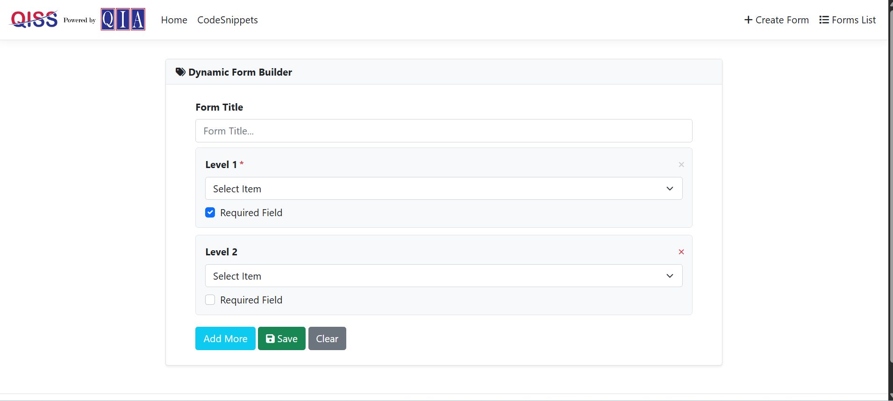
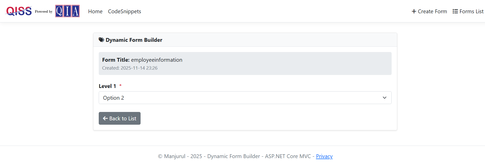
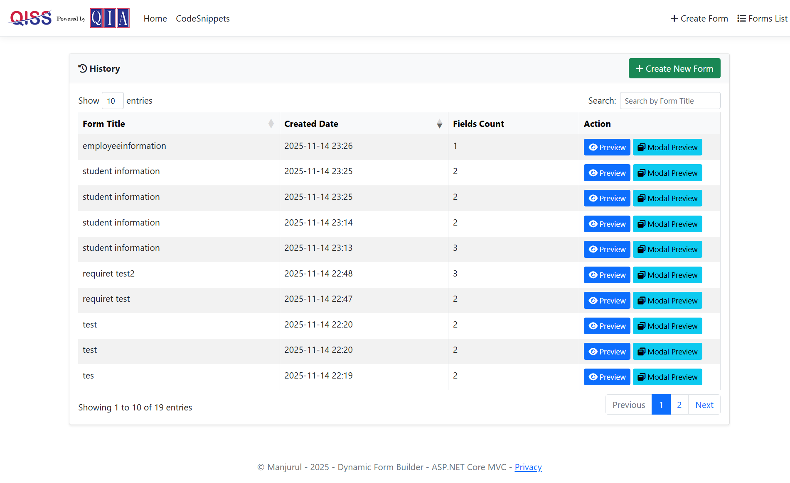
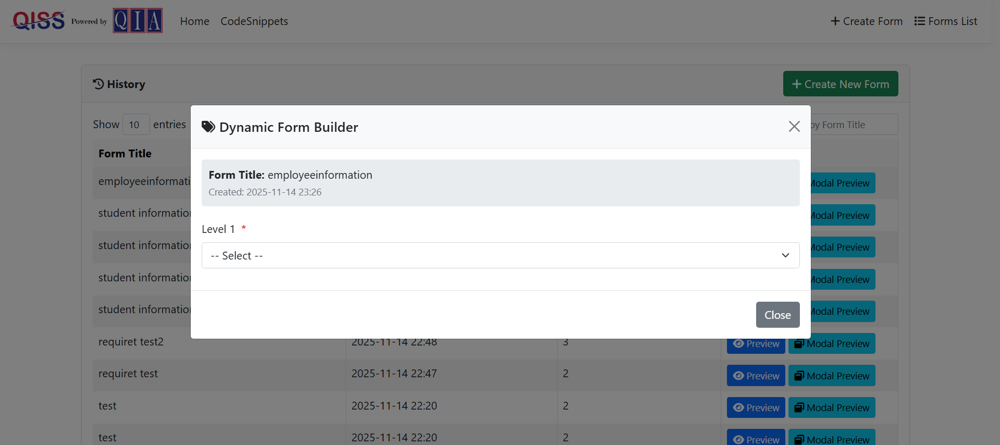

# Dynamic Form Builder - ASP.NET Core Razor Pages

A powerful, user-friendly web application that allows users to dynamically create, manage, and preview custom forms with dropdown fields. Built with ASP.NET Core 8, this application demonstrates modern web development practices including the Repository Pattern, Service Layer Architecture, and API integration.

## 📋 Table of Contents

- [Project Overview](#project-overview)
- [Features](#features)
- [Technology Stack](#technology-stack)
- [Prerequisites](#prerequisites)
- [Installation & Setup](#installation--setup)
- [Database Setup](#database-setup)
- [Project Structure](#project-structure)
- [Usage Guide](#usage-guide)
- [API Endpoints](#api-endpoints)
- [Key Components](#key-components)
- [Architecture & Design Patterns](#architecture--design-patterns)
- [Code Snippets](#code-snippets)
- [Bonus Features](#bonus-features)
- [Troubleshooting](#troubleshooting)
- [Contributing](#contributing)
- [License](#license)

---

## 🎯 Project Overview

The **Dynamic Form Builder** is a comprehensive ASP.NET Core application designed to streamline the process of creating, saving, and managing custom forms without writing a single line of code. Users can dynamically add form fields, set requirements, and preview their forms before saving them to the database.

**Project Duration:** 2 Days  
**Repository:** [GitHub - DynamicFormBuilderQIA](https://github.com/manjurul0992/DynamicFormBuilderQIA)  
**Branch:** `SecondDays`  
**Status:** Production Ready ✅

### What You Can Do

- ✅ Create forms with custom titles
- ✅ Dynamically add/remove dropdown fields
- ✅ Mark fields as required with visual indicators
- ✅ Save forms to SQL Server database
- ✅ Preview saved forms with selected options
- ✅ Manage forms in a paginated grid
- ✅ Delete forms with confirmation
- ✅ Access data via RESTful API

---

## ✨ Features

### Core Features

#### 🔧 Dynamic Form Creation
- Create forms with custom titles
- Dynamically add/remove dropdown fields
- Automatic level assignment (Level 1, Level 2, etc.)
- Mark individual fields as required
- Form validation on client and server side
- Real-time field updates

#### 📊 Form Management
- Save forms to SQL Server database
- Display all forms in a paginated DataTable grid
- Search forms by title
- Delete forms with SweetAlert2 confirmation
- View form creation timestamps
- Track field count per form

#### 👁️ Form Preview
- View saved forms with all field information
- Display selected options in dropdowns
- Show required field indicators (red asterisks *)
- Modal-based preview functionality
- Clean, readable layout with form metadata

#### 🎨 User Interface
- Responsive Bootstrap 5 design
- Accordion-based code snippets display
- Toast notifications for user feedback
- SweetAlert2 confirmation dialogs
- Font Awesome 6.4.0 icons
- Professional styling and animations

#### 🔌 API Integration
- RESTful API endpoints for all operations
- Server-side pagination via DataTables
- JSON serialization for data transfer
- Comprehensive error handling
- AJAX-based data loading

#### 🧩 View Components
- Reusable dropdown component
- Dynamic HTML generation
- Clean separation of concerns
- Encapsulated component logic

---

## 🛠️ Technology Stack

| Layer | Technology | Version |
|-------|-----------|---------|
| **Framework** | ASP.NET Core | 8.0 |
| **Language** | C# | 12.0 |
| **UI Framework** | Bootstrap | 5.x |
| **Database** | MS SQL Server | 2019+ |
| **Data Access** | ADO.NET | Native |
| **ORM** | Stored Procedures | T-SQL |
| **Frontend Grid** | DataTables | 1.13.7 |
| **Validation** | jQuery Validation | 1.19.x |
| **Icons** | Font Awesome | 6.4.0 |
| **Alerts** | SweetAlert2 | 11.x |
| **HTTP Client** | jQuery AJAX | 3.6.x |
| **Version Control** | Git | Latest |

---

## 📋 Prerequisites

Before you begin, ensure you have the following installed:

### Required Software

- **.NET 8 SDK** (v8.0.0 or higher)
  - [Download .NET 8](https://dotnet.microsoft.com/download/dotnet/8.0)
  - Verify: `dotnet --version`

- **Visual Studio 2022** (Community Edition or higher)
  - [Download Visual Studio 2022](https://visualstudio.microsoft.com/downloads/)
  - Required Workloads:
    - ASP.NET and web development
    - .NET desktop development

- **SQL Server 2019** or higher
  - [Download SQL Server Express](https://www.microsoft.com/en-us/sql-server/sql-server-downloads)
  - Or use: Azure SQL Database, LocalDB

- **SQL Server Management Studio (SSMS)**
  - [Download SSMS](https://learn.microsoft.com/en-us/sql/ssms/download-sql-server-management-studio-ssms)
  - Version 19.0 or higher

- **Git** (for cloning repository)
  - [Download Git](https://git-scm.com/)
  - Verify: `git --version`

### System Requirements

- **Operating System:** Windows 10/11, macOS, or Linux
- **RAM:** Minimum 4GB (8GB recommended)
- **Disk Space:** 500MB free space
- **Internet Connection:** Required for NuGet packages
- **Administrator Access:** For database creation and SQL Server setup

### Optional Tools

- **Visual Studio Code** - Lightweight editor alternative
- **Azure Data Studio** - Cross-platform SQL tool
- **Postman** - API testing tool

---
## 📸 Application Screenshots

### 🔹 Code Snippet

### 🔹 Create Page UI

### 🔹 Form Preview

### 🔹 Index Page (List)

### 🔹 Preview Modal

## 🚀 Installation & Setup

### Step 1: Clone the Repository
